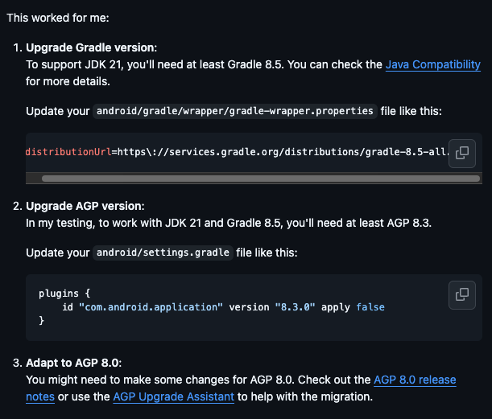
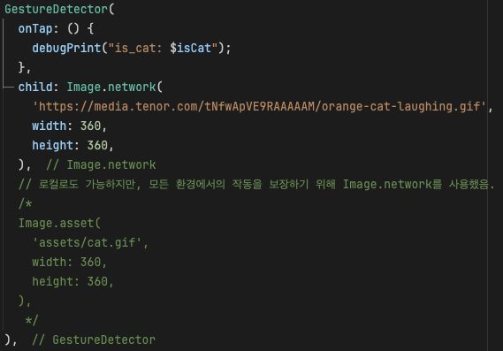
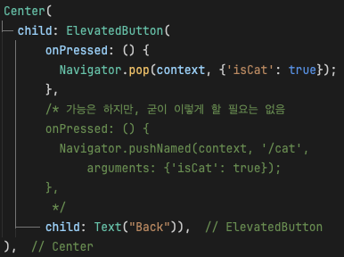
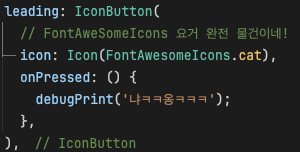

# 회고록

## 오류 해결 시도

### JAVA / Gradle 버전 이슈

해결 방법

1. <https://github.com/flutter/flutter/issues/156304>
2. `sudo rm -rf /Library/Java/JavaVirtualMachines/`
3. `brew install openjdk@21`
4. 
   - 나는 2번까지만 진행했는데도 해결되었다.

## 고민 기록

### `Image.network` vs `Image.asset`

### `Navigator.pop` vs `Navigator.pushNamed`

### `FontAwesomeIcons`

## 주절주절

- GPT 디톡스를 위하여, 최대한 GPT에 의지하는 것을 자제해보았다.
  - 코드 구조나 세부 구현 방식이 잘 기억나지 않아, 이전에 작성해둔 코드나 교재의 샘플 코드를 자주 비교하고 참고하게 되었다.
    - 덕분에 코드 구조가 전체적으로 좀 더 한 눈에 보이고 직관적으로 와닿기 시작했다.
  - 그럼에도 불구하고, 역시 '귀찮은 일'은 GPT에게 짬때리는 게 최고였다.
    - 어쨌든, 요즘 시대에 GPT를 활용하는 것을 전면적으로 금지하는 것은 다가올 미래를 방관하는 아날로그식 극약처방이라고 보기 때문이다.
  - 이제 어떤 상황에 GPT를 사용하는 게 좋을지 슬슬 감이 오기 시작한다.
- Android Studio에 내장된 기능들이 어마어마하게 좋은 것들이 정말 많다는 것을 새삼스레 느꼈다.
  - VSCode는 가벼운 `에디터`로, Android Studio는 무거운 `IDE`로서 정체성을 확실히 하기로 했고, 이런 역할의 구분은 확실히 유용한 선택이었다는 생각이 든다.
  - 나중에 Android Studio 친해지기 쉐밸그투 열어야겠다.
